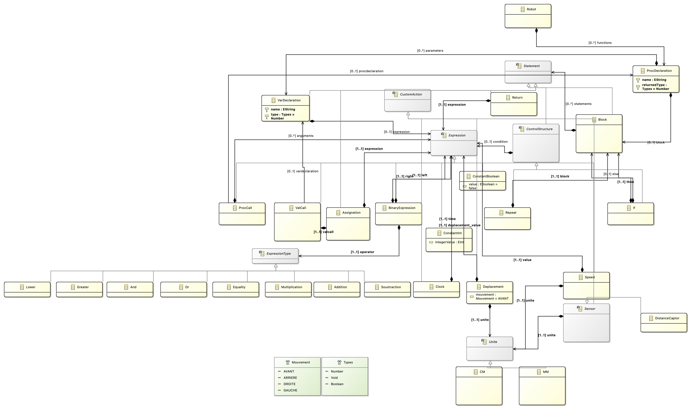
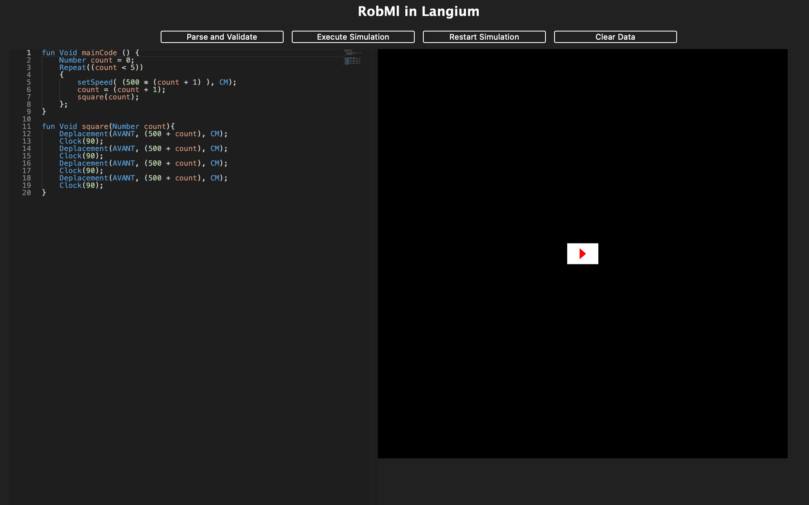

# 
 Advanced Software Engineering

Ce rapport présente nos travaux sur la création d'un langage de programmation RobML destiné à mouvoir un robot en transformant le language en langage Arduino et à simuler de déplacement d'un robot dans un environnement de développement en ligne. 

# I/ Création du modèle du langage

Le langage a été modélisé en utilisant ECORE sur Eclipse. Celui est basé sur l'idée suivante : 
Un Robot peut posséder plusieurs déclaration de fonction appelée ProcDeclaration. Au sein d'une déclaration de fonction peut exister un Block, composé de Statements qui peuvent être des ControlStructure, des CustomAction, ou des Expressions.

## ControlStructure
Les controlStructures sont des éléments représentant les structures de contrôle du langage à partir d'une condition Booléenne. Il a été décidé d'implémenter deux types de controlStructures dans notre langage : le repeat, et le if.
Le if est un conditionnel utilisé pour prendre des décisions conditionnelles et exécuter du code seulement si la condition est remplie. Il peut posséder un else qui exécutera du code si la condition n'est pas rempli. Le repeat exécute un morceau de code tant que la condition est remplie.

## CustomAction
Les customActions sont les éléments spécifiques au langage que nous avons décider d'implémenter. Dans ceux-ci, on peut retrouver les capteurs, un capteur a été implémenter pour l'exemple, il s'agit du capteur de distance afin de pouvoir récupérer une distance ainsi qu'une unité. On peut également retrouver Speed, qui est une instruction permettant de fixer la vitesse du robot. De plus, l'instruction Clock a été implémenté afin de représenter un temps de pause pour le robot. Enfin les déplacements ont également été implémenté. Ceux-ci peuvent être dans 4 directions AVANT, ARRIERE, GAUCHE ou DROITE et s'accompagne d'une valeur ainsi que d'une unité. 

## Unité 
Les unités sont une interface afin de pouvoir en rajouter rapidement au fil du temps. Pour l'instant seul les CM et les MM ont été implémenté.

## Expression
Les expressions représentent deux types d'expressions, les expressions booléennes et les expressions arithmétiques. Celle-ci peuvent être obtenus à l'aide d'appel de fonction (ProcCall), d'appel de variable (VallCall), des capteurs (Captors), ou bien des constantes entières ou booléennes (3 ou true par exemple via ContantInt et ConstantBoolean). Celle-ci peuvent également être obtenu à l'aide des binaryExpression, c'est à dire d'opération entre deux expressions. Pour les opérateurs arithmétiques, il a été décidé d'implémenter Multiplication, Addition, et Soustraction représentant les multiplications, additions et soustractions. Tandis que pour les opérateurs booléens il a été décidé d'implémenter Lower, Greater, And, Or et Equality, représentant l'inégalité inférieure et supérieure, le 'et' et le 'ou' conditionnel et l'égalité. 

## Déclaration de variable et type dans le langage
Il est évidemment possible de déclarer des variables dans le langage grâce à Assignation, une variable sera associé à un nom, un type et une valeur. Un choix a été fait pour seulement retenir trois types dans le langage, les nombres (Number), les conditions (Boolean) et le type vide (VOID, pour les retours de fonctions vides).

# II/ Langium
Après avoir créer le modèle du langage, on exporte la grammaire générée via Xtext en langium afin de continuer le développement sur VSCode en TypeScript/JavaScript. On redéfinit ensuite la grammaire afin de la faire correspondre à notre idée du langage. Celle-ci se trouve dans les fichiers rob.langium et robML-types.langium dans le dossier src.

# III/ Visiteur et weaver
Pour accomplir les deux objectifs, il a d'abord fallu créer une classe pour représenter une structure syntaxique abstraite (AST) et une hiérarchie d'objet à partir des objets générés précédemment. C'est ce qui est fait dans le fichier visitorNode.ts au sein du dossier semantics. Dans ce fichier, on définit une interface RobotMLVisitor pour un visiteur qui peut être utilisé pour parcourir et effectuer des actions sur les différents nœuds de l'AST. Chaque classe de visiteur (comme RobotVisitor, ProcDeclarationVisitor, etc.) correspond à un type spécifique de nœud dans l'AST. Ces classes héritent des interfaces générées à partir de notre AST. Chaque classe de visiteur implémente une méthode accept qui prend un visiteur en paramètre. Cette méthode appelle la méthode spécifique du visiteur pour le nœud actuel, permettant ainsi de déléguer le traitement à la méthode appropriée du visiteur. Les classes de visiteur contiennent des propriétés qui représentent les différentes parties des nœuds de l'AST. Par exemple, la classe ProcDeclarationVisitor a des propriétés telles que name, returnedType, et block qui représentent les composants d'une déclaration de fonction. Certains nœuds, comme Reference&lt;VarDeclarationVisitor&gt;, utilisent des références pour établir des liens entre différentes parties de l'AST. 

Un système de weaver est également implémenté dans le fichier accept-weaver.ts dans le dossier semantics. Celui-ci sert à implémenter des méthodes accept pour chaque nœud concret du langage de programmation représenté par l'Abstract Syntax Tree (AST) afin de les relier vers les méthodes implémentés dans le fichier visitNode.ts en utilisant les classes crées. La logique de weaver est également utilisée dans le contexte de la validation personnalisée du langage. On peut relever les différents points principaux. 
La fonction weaveAcceptMethods prend en paramètre un objet services de type RobServices qui contient un registre de validation et créer une instance de la classe RoboMlAcceptWeaver pour enregistrer les vérifications de validation définies dans le registre de validation. La classe RoboMlAcceptWeaver contient des méthodes de weaver pour chaque type de nœud concret du langage robotique. Chaque méthode de weave modifie la méthode accept du nœud en cours pour utiliser la méthode de visiteur appropriée de la classe de visiteur correspondante. Cela permet d'associer dynamiquement la méthode de visiteur correcte avec le nœud concret lors de la validation. Enfin, la propriété checks est un objet qui mappe chaque type de nœud du langage robotique avec sa méthode de tissage correspondante.

# IV/ Compilateur 
Pour la partie compilateur, servant à transformer le code en langage Arduino pour le délivrer au robot. Pour celà, on implémente un visiteur dans compilaterVisitor.ts dans le dossier semantics. Celui-ci visite les différentes classes et traduit le code en C pour de l'Arduino. Le résultat est ensuite écrit dans le fichier outputArduino.ino dans le dossier semantics. Dans ce dossier est également écrit du code provenant du fichier defaultArduino.ino dans le dossier semantics. Le code de ce fichier sert à traduire certaine fonction de base du langage comme les fonctions de déplacement par exemple en utilisant la bibliothèque fournie (situé dans le dossier lib). Le compilateur fonctionne en lançant les commandes notamment contenu dans le fichier compiler.bat (on peut directement lancer le programme sur Windows). Parmis celle-ci se trouve une méthode compile écrite dans le fichier main.ts dans le dossier src/cli. Celles-ci prend en argument le fichier contenant le code écrit dans notre langage et lorsque la commande est exécutée, une action asynchrone est déclenchée. Cette action prend le nom du fichier passé en tant qu'argument (fileName) et effectue les étapes suivantes. Tout d'abord la création des services nécessaires pour notre langage (createRobServices(NodeFileSystem)) puis l'extraction du modèle AST (Abstract Syntax Tree) à partir du fichier source (extractAstNode&lt;RobotVisitor&gt;(fileName, services)). Enfin, elle compile le code en utilisant la fonction compileRobot du compilateur avec le modèle AST extrait. La méthode statique compileRobot définit dans le fichier compiler.ts dans le dossier semantics permet un point d'accès au visiteur pour le compilateur.

# V/ Interpreteur
Dans la partie interpréteur, servant à interpréter et simuler le code dans un éditeur en ligne, on utilise un visiteur implémenté dans le fichier intepreterVisitor.ts dans le dossier semantics. La classe InterpreterImplementation contient des méthodes spécifiques pour chaque type de nœud dans l'AST, permettant l'exécution des actions correspondantes. L'interpréteur utilise une pile de contexte (StackList) pour gérer la portée des variables pendant l'exécution du programme. Les déclarations de mouvements du robot sont enregistrées dans une liste (StatmentList) afin d'être utilisé pour la représentation des mouvements du robot dans l'éditeur en ligne. Des fonctionnalités telles que les appels de procédures, les expressions binaires, les boucles repeat, les déclarations de variables, les conditions if, et d'autres, sont traitées de manière récursive. L'interpréteur effectue également des opérations d'affichage lorsqu'une fonction spécifique, telle que "print", est appelée. En fin de compte, l'exécution du programme est initiée à partir de la méthode visitRobot, qui traverse le nœud principal du programme, déclenchant ainsi l'interprétation du code robotique. 

# VI/ Editeur

Après avoir suivi le [tutoriel](https://langium.org/tutorials/langium_and_monaco/) donné dans la documentation, l'éditeur en ligne (en utilisant monaco) a été implémenté et peut être utilisé en rentrant les commandes écrites dans le fichier interpreter.bat (Pour windows) ou le script run.sh. Parmis celle-ci se trouve une commande interpret écrite dans le main.ts situé dans le dossier src/cli permettant de lancer une méthode asynchrone pour prendre le nom du fichier en paramètre, créer les services nécessaires pour notre langage (createRobServices(NodeFileSystem)) avant d'extraire le modèle AST Abstract Syntax Tree) à partir du fichier source (extractAstNode&lt;RobotVisitor&gt;(fileName, services)) puis d'appeler la méthode statique interpretRobot permettant d'appeler le visiteur de l'interpreter.

Voici à quoi ressemble notre éditeur. Nous pouvons le découper en 3 zones :
- L'éditeur lui-même avec sa zone de texte. Permet à l'utilisateurs de rentré le code qu'il veut dans le langage que l'on vient de créer.
- Le simulateur qui se trouve à droite. Cette partie sert à simuler le code que l'utilisateurs aura écrit dans la partie de gauche.
- Les boutons d'actions qui se trouvent au dessus. Ils sont au nombres de 4 avec chacun sa fonctionnalités. Dans la version seule 3 des 4 boutons ont réussi à être implémentés.
    - "Parse and Validate" : Ce bouton qui est celui qui nest pas implémenté, devait parcourir le code écrit par l'utilisateur afin de vérifier que celui-ci est correct à la syntaxe et la grammaire de notre langage. Dans le cas où sa ne l'était pas une modale s'ouvrirait afin de dire qu'elles sont les erreurs et sur quelle lignes. Dans le cas contraire si les informations sont corrects, alors une modale apparait afin d'informer l'utilisateur que le code est bien écrit et qu'il peut l'éxecuter.
    - "Execute Simulation" : Ce bouton permet de venir executer le code rentré par l'utilisateur et de le simuler dans la partie de droite.
    Avec plus de temps, il aurait été judicieux je pense de mettre une sécurité entre les 2 premiers boutons et faire en sorte d'activer le bouton "Execute simulation" que si le code est valide.
    - "Restart simulation" : Ce bouton permet tout simplement de remettre la partie simulation dans son état initial (c'est à dire remmetre le robot au milieu) mais ne touche pas au code.
    - "Clear data" : Ce dernier bouton sert à effacer complètement le code écrit par l'utilisateurs mais également remet la simulation à 0.

Cependant, un problème lors de la communication avec les weavers lors de l'interprétation depuis l'éditeur font que le code écrit par l'utilisateurs n'est pas pris en compte et les robot ne se déplace pas sur l'écran malgré le fait que l'interprétation est effectuée. 

## 🛠️ Tech Stack
- [Ecore](https://eclipse.dev/modeling/emf/)
- [Langium](https://langium.org/)
- [Xtext](https://eclipse.dev/Xtext/)
- [TypeScript](https://www.typescriptlang.org/)
- [JavaScript](https://developer.mozilla.org/fr/docs/Web/JavaScript)

## 🙇 Author
#### Voisin Enzo
- Github: [@Enzo](https://github.com/Slonev0)
- Adresse mail : [Mail universitaire](enzo.voisin@etudiant.univ-rennes.fr)

#### Mathurin Melvin
- Github: [@Melvin](https://github.com/ghost-hikaru)
- Adresse mail : [Mail universitaire](melvin.mathurin@etudiant.univ-rennes.fr)

